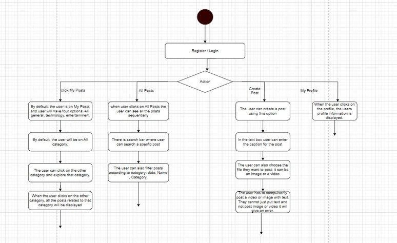
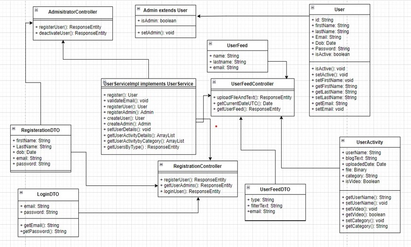

This project aims to manage content efficiently

## Table of Contents
- [Description](#description)
- [Objective](#objective)
- [Sequence Flow](#Sequence-diagram)
- [Classes](#Classes)
- [Class Diagram](#Class-Diagram)
- [Installation Guide](#Installation)

# Content Management Systems

## Description
This CMS is a modern, advanced content management system designed specifically for organizational or social use in today's digitally connected world. CMS named as EchoSphere provides a dynamic platform where members of any organization can express themselves and manage their digital content with remarkable ease and versatility. It's also ideal solution for organizations seeking to foster a rich environment of social connectivity and digital storytelling among their members. 

## Objective
To design and develop a robust and user-friendly CMS catering to diverse content creation, management, and interaction needs in the digital realm.

## Features

### 1. User Registration and Login
- Secure account creation and login.
- User profile management.

### 2. Content Creation
- Tools for uploading and managing images and videos.
- Supports various content formats and templates.
- Feedback through comments.

### 3. Content Management
- Editing, publishing, and archiving features.
- Organizational tools like categories, tags, and custom metadata.

### 4. Search and Filtering
- Advanced search functionality.
- User-friendly filtering and sorting.

## Main Actors

- **User (Author/Creator):** Creates, edits, and manages content.
- **Viewer:** Consumes and interacts with content.

## Use Cases

- **User Registration and Login:** Account creation and secure login.
- **Content Creation:** Creation, editing, and deletion of content.
- **Content Management:** Content publication, archiving, and organization.
- **Search and Filtering:** Enhanced search and content filtering capabilities.

## Assumptions
- **Content Formats: Supports text, images, videos with standard size and format limits.
- **Visibility and Access: Restricted access for organization members.
- **User Registration: Secure registration and authentication.
- **Search and Filtering: Robust search engine with extensive filters.
- **Content Management: Full control over content by authors.
- **Platform Accessibility: Compatible with various devices and browsers.

## Sequence-Diagram
To view the sequence diagram, see below:



## Classes

### Controllers

Controllers handle incoming HTTP requests, process them, and return the appropriate response to the user.

- **AdministratorController:** Used to create/delete users & admins.
- **RegistrationController:** Used for registration and login.
- **UserFeedController:** Handles user feed operations, such as displaying and updating feed content.

### Config

Configuration classes set up crucial aspects of the application, such as security and database settings.

- **PasswordEncoderConfig:** Sets up password encoding for secure authentication.
- **SecurityConfig:** Configures security measures like user authentication and access rules.
- **MongoConfig:** Establishes and configures the MongoDB database settings.

### Repository

Repositories provide an abstraction layer for data access and manipulation, facilitating interaction with the database.

- **User:** Defines the properties and behaviors of a standard system user.
- **UserActivity:** Represents the structure and data of a user's personal activity.
- **UserFeed:** Main object component with details of corresponding user and its activity feed.
- **UserFeedRepository:** Handles database operations for user feed data.
- **UserRepository:** Responsible for CRUD operations on user data.
- **Admin:** Represents an administrator with special permissions and functions.
- **AdminRepository:** Manages database interactions specific to admin users.

### Services

Service classes contain the business logic of the application, working between the controllers and repositories.

- **UserService:** Outlines the business logic for user management tasks.
- **UserServiceimpl:** Implements the defined UserService, executing user-related business logic.

## Class-Diagram
To view the class diagram, see below:




## Installation

Follow these steps to set up the environment and run both the front-end and back-end parts of EchoSphere CMS.

## Prerequisites

Before you start, ensure you have the following installed:
- Git
- Node.js and npm
- Docker and Docker Compose
- IntelliJ IDEA (recommended for back-end development)
- MongoDB

### Clone the Repository

First, clone the EchoSphere CMS repository to your local machine:

```bash
git clone <REPOSITORY_URL>

Front-end Setup
To set up and run the front end, navigate to the cms-frontend folder:
cd cms-frontend
npm install
npm run dev

Back-end Setup
For the back-end setup, first, navigate to the cms-backend folder:

cd ../cms-backend
docker-compose up
run cms-application folder on Intelij preferrably 


